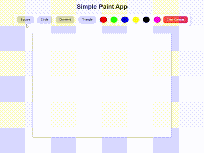

# Simple Paint App

Welcome to the repository of my **Simple Paint App**, which demonstrates the use of **HTML**, **CSS**, and **JavaScript** to create a simple drawing application on a canvas.

## 📖 What is this?

This project is an interactive application for drawing different shapes on an HTML5 canvas. It allows users to select shapes (square, circle, diamond, triangle), colors, and dynamically modify the canvas with mouse clicks.

### 🌟 Key Features:

1. **Shape Selection**:
   - Users can choose from four shapes: square, circle, diamond, triangle.
   - Each shape has unique behavior, for example, the circle is drawn with respect to its radius, while the diamond is rotated by 45 degrees.

2. **Color Selection**:
   - A palette is provided for selecting the color of each shape.
   - The color of the selected shape can be changed before drawing.

3. **Shape Dragging**:
   - Users can drag the drawn shapes on the canvas with the mouse.
   - During dragging, the shape is highlighted with a gray border.

4. **Canvas Clearing**:
   - The "Clear Canvas" button allows users to quickly clear the entire canvas and start over.

## 💡 Why is this important?

Understanding how to work with the **canvas** and manipulate elements through JavaScript provides foundational skills for building interactive web applications. This project helps to develop skills in:
- **Interactive user interaction** with mouse events.
- **Shape manipulation** using the canvas API.
- **Dynamic content updates** without reloading the page.

## 🚀 What am I doing here?

In this repository, I am practicing the following:
- Using **JavaScript** to dynamically interact with HTML5 canvas.
- Manipulating shapes and colors in real time.
- Creating a user-friendly interface using **CSS** and **JavaScript**.

This project is part of my journey to learn **front-end development**, where I improve my skills in working with HTML elements and JavaScript.

## 🎥 Demo
пш

  

