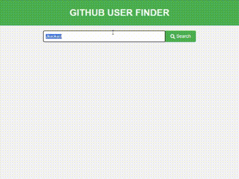

# GitHub User Finder

Welcome to the **GitHub User Finder** project! This application allows users to search for GitHub profiles by username and displays detailed information in a clean, user-friendly interface.

### 📌 What is this?

This project is a web-based tool that lets users enter a GitHub username and retrieve profile information through the GitHub API. It provides a quick and easy way to get details like name, login, profile URL, location, and more.

### ✨ Key Features

1. **User Search**  
   - Enter a GitHub username to search for the user's profile.
   - Retrieves data directly from the GitHub API and displays it in real-time.

2. **Information Display**  
   - Displays detailed profile info such as name, login, location, email, followers, and following count.
   - Provides a link to the user's GitHub profile.

3. **Loading Indicator**  
   - A loader appears while fetching data, enhancing user experience with feedback.

### 📂 Project Structure

#### index.html
This file contains the HTML structure of the application. It includes a form for entering a GitHub username, a search button, and sections to display user information.

#### script.js
The JavaScript file responsible for handling the user search functionality. It listens for the search button click, makes an API call to GitHub, and updates the page with the retrieved data.

- **Key functions**:
  - `DOMContentLoaded`: Ensures elements are loaded before attaching event listeners.
  - `searchButton.addEventListener("click")`: Fetches data based on the entered username.
  - `request.onload`: Handles the API response, populating the UI with user data or showing an error if the user is not found.

#### styles.css
The CSS file styling the application interface. It includes styles for the header, form, user information card, and loader animation to create a professional and visually appealing layout.

- **Main styles**:
  - `.header`: Styles the page header.
  - `.form`: Styles the input and search button.
  - `.user-info`: Configures the layout for displaying user details.
  - `.loader`: Animates the loading spinner during data fetching.

### 🔥 Why is this important?

This project demonstrates core skills in front-end development, including:

- API integration and data handling.
- Interactive UI design with loading states and error handling.
- Organized code structure for HTML, CSS, and JavaScript.

### 🛠️ How to use

1. **Clone the repository**:  
   ```bash
   git clone <repository_url>
   ```
2. **Open `index.html` in your browser**.

### 📚 Additional Information

This project showcases the use of JavaScript to interact with APIs and manipulate the DOM. The styling with CSS provides a professional interface, making it suitable for use cases requiring quick GitHub profile lookups.

---

### 📸 Demo

<div align="center">
  
</div>