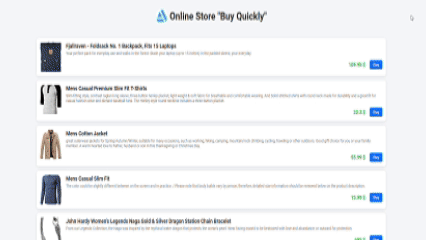

# Online Shop

Welcome to the **Online Shop** project! This application allows users to browse products, add items to a shopping cart, and place orders through a simple, interactive interface.

### 📌 What is this?

This project is a web-based shopping application that provides a list of products fetched from a public API. Users can view product details, add items to their cart, and proceed to checkout. It’s designed to mimic a basic e-commerce experience.

### ✨ Key Features

1. **Product Display**  
   - Lists products with images, names, descriptions, and prices.
   - Data is fetched from the [Fake Store API](https://fakestoreapi.com/products?limit=12) and updated in real-time.

2. **Cart Functionality**  
   - Allows users to add products to a cart.
   - Users can adjust quantities or remove items.
   - Cart automatically updates the total price.

3. **Order Form**  
   - Provides an order form where users enter their details (name, address, phone).
   - Validates input for name and phone number formats.
   - Displays a confirmation message upon order submission.

4. **Loading Indicator**  
   - A loader is shown while products are being fetched, providing feedback to the user.

### 📂 Project Structure

#### index.html
This file contains the HTML layout, including the product list, cart, and order form. It also has an interactive search bar for product browsing.

#### script.js
JavaScript for managing product fetching, cart functionality, and order processing.

- **Key Functions**:
  - `getProducts`: Fetches product data from the API.
  - `renderProducts`: Dynamically generates product listings.
  - `addToCart`: Adds items to the cart and updates the total.
  - `submitOrder`: Validates and processes user input in the order form.

#### styles.css
The CSS styles for structuring and styling the application.

- **Main styles**:
  - `.product-item`: Styles for each product card.
  - `.cart-list`: Layout for cart items.
  - `.checkout-form`: Styles for the order form and its fields.

### 🔥 Why is this important?

This project demonstrates essential skills for web development, including:

- API integration for data fetching.
- DOM manipulation and event handling.
- Form validation and data storage.

### 🛠️ How to use

1. **Clone the repository**:  
   ```bash
   git clone <repository_url>


### 📸 Demo

<div align="center">
  
</div>