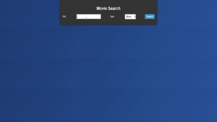

# Movie Search

Welcome to the **Movie Search** project! This application allows users to search for movies, series, or episodes by title and view detailed information about each result. It provides a smooth, interactive experience with pagination, preloader animations, and a responsive design.

### 📌 What is this?

This project is a web-based tool that lets users enter a movie title and search for related films, series, or episodes through the OMDb API. The app displays search results and offers details on selected items, including title, year, genre, director, and IMDb rating.

### ✨ Key Features

1. **Search Movies by Title**
   - Enter a movie title to fetch results directly from the OMDb API.
   - Select the type of media: Movie, Series, or Episode for specific search results.

2. **Detailed Information Display**
   - View details like title, year, genre, director, IMDb rating, and plot summary.
   - A high-resolution poster (or placeholder image) for each result enhances the user experience.

3. **Interactive UI with Pagination**
   - Smooth pagination allows users to navigate through search results page by page.
   - Pagination buttons dynamically adjust to display only a limited set of page options.

4. **Loading Indicator**
   - A loading spinner appears while data is being fetched, ensuring users know the app is working.

5. **Scroll to Top Button**
   - Quickly return to the top of the page with a scroll-to-top button for improved navigation.

### 📂 Project Structure

#### index.html
Contains the HTML structure for the search form, movie results, and movie details sections.

#### script.js
Handles the app’s functionality, including:
   - Fetching movie data from the OMDb API.
   - Rendering search results and pagination.
   - Displaying detailed information for a selected movie.

   - **Key functions**:
     - `searchMovies()`: Searches for movies based on the title and type.
     - `getMovieDetails()`: Fetches detailed information for a selected movie.
     - `createPaginationButtons()`: Generates pagination buttons dynamically.

#### styles.css
The CSS file responsible for the design, ensuring a clean, responsive layout and animations:
   - `.container`: Centers content and adds padding.
   - `.movie`: Styles each movie card with a poster, title, and details button.
   - `.spinner`: Animates a loading spinner during data fetching.
   - `.scrollToTop`: Styles the button to quickly scroll to the top of the page.

### 🔥 Why is this important?

This project demonstrates key skills in:
- Working with external APIs.
- Building interactive, data-driven interfaces.
- Ensuring good user experience with animations and responsive design.

### 🛠️ How to use

1. **Clone the repository**:  
   ```bash
   git clone <repository_url>


### 📸 Demo

<div align="center">
  
</div>